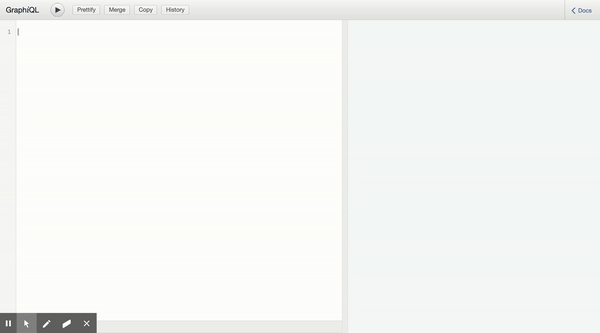
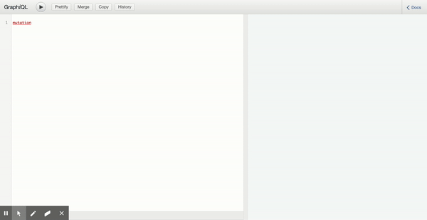
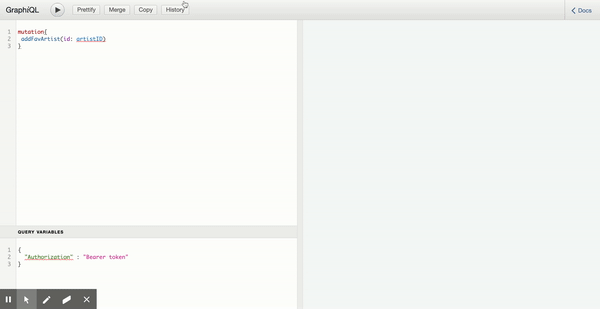
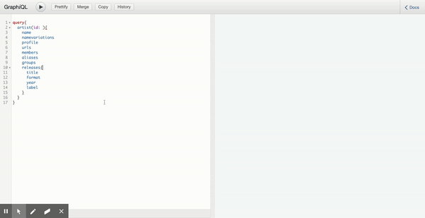

# On-Track

## Description :

On-Track is personnal project using the [Discogs API](https://www.discogs.com/developers) to retrieve informations about artists, record labels and releases. [Discogs](https://www.discogs.com/) is a crowdsourced database as well as a marketplace for people to buy and sell vinyls.
A lot of music enthousiasts use Discogs as a tool to discover new artists and labels. As a user myself, I thought I could improve my experience by creating a platform to keep track of the next releases of my favourite artists and labels.

## Tools

The backend is in Node.js with GraphQL and mongoDB, and is deployed on Heroku. I used graphql schema definition language(SDL) to define the graphql schema and resolvers, as I think it provides a much better readability than graphQL.js, especially when the project start to grow and have quite a few types defined.

This is still a work in progress, not all functionnalities are ready yet.
The frontend will come soon and will use React/TypeScript with Apollo.

## Try the API

### Authentication

1. Go to the [GraphiQL playground](https://on-track-discogs.herokuapp.com/graphql).
2. Signup 
   
3. Or login with the credentials you just created (or use the fake email 'test@gmail.com' with the password 'test1')  
   
4. Keep the token you received

### Add an artist, label or release to your favourites

1. Add variables in the bottom left corner :  
   {
   "Authorization" : "Bearer **your token here**"
   }
2. Select the mutation you want (addFavEP, addFavLabel, addFavArtist) and pass in the argument the id. You will find it on the discogs url (e.g id 1773572 in https://www.discogs.com/artist/1773572-Central-7)  
   

### Query an artist, label or release from the Discogs database

1. Choose your query and pass in the argument id of the desired artist/label/release. You will find in on the discogs url (e.g id 1773572 in https://www.discogs.com/artist/1773572-Central-7)  
   
